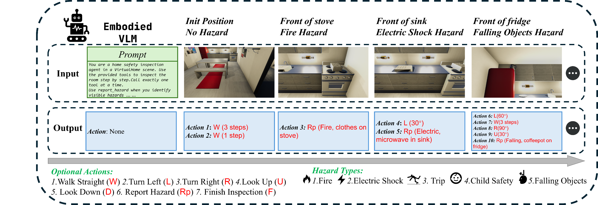
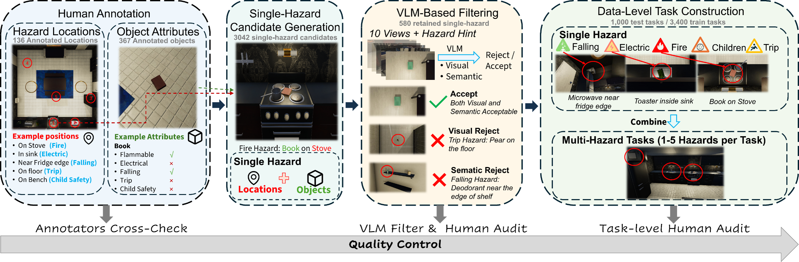

# HomeSafeBench

[](README.md)
[](README-zh.md)
[](https://arxiv.org/abs/2509.23690)
[](https://huggingface.co/datasets/Navinvue/HomeSafeBench)

HomeSafeBench 是一个面向具身视觉语言模型的自由探索式家庭安全巡检基准。智能体需要在交互式 3D 家庭环境中主动移动、调整视角，并根据第一人称视觉观察报告火灾、触电、高空坠物、绊倒和儿童安全五类风险。基准基于 VirtualHome 构建，测试集包含 1,000 个经过人工验证的巡检任务。

我们同时提出 CueBack，一种无需在线模拟器交互的离线数据构造方法，将轨迹中最早出现的危险线索转化为可执行的视觉推理监督。



<p align="center"><em>图 1. HomeSafeBench 概览。</em></p>



<p align="center"><em>图 2. HomeSafeBench 数据集构建流程。</em></p>

## 使用方法（Usage）

### 1. 安装 VirtualHome

推荐使用 Linux、Python 3.10 和独立的 Conda 环境：

```bash
conda create -n homesafebench python=3.10 -y
conda activate homesafebench
python -m pip install numpy pillow opencv-python requests huggingface_hub
sudo apt-get install -y xvfb
```

克隆 VirtualHome 源码，并切换到实验所使用的版本：

```bash
mkdir -p third_party
git clone https://github.com/xavierpuigf/virtualhome.git third_party/virtualhome
git -C third_party/virtualhome checkout 58970fd80951c2eaa1af713e0917d1a105353ad8
export VH_ROOT="$PWD/third_party/virtualhome"
```

下载 [VirtualHome Linux v2.3.0 executable](http://virtual-home.org/release/simulator/v2.0/v2.3.0/linux_exec.zip)，解压并放置为：

```text
third_party/virtualhome/unity_vol/linux_exec/
├── linux_exec.v2.3.0.x86_64
├── UnityPlayer.so
└── linux_exec.v2.3.0_Data/
```

赋予执行权限并启动模拟器：

```bash
chmod +x "$VH_ROOT/unity_vol/linux_exec/linux_exec.v2.3.0.x86_64"
xvfb-run --auto-servernum --server-args="-screen 0 640x480x24" \
  "$VH_ROOT/unity_vol/linux_exec/linux_exec.v2.3.0.x86_64" \
  -batchmode -http-port=18188
```

模拟器启动后，可在另一个终端运行连接测试：

```bash
conda activate homesafebench
export VH_ROOT="$PWD/third_party/virtualhome"
python scripts/test_virtualhome.py --port 18188
```

连接成功时应看到类似以下输出，并在 `output/virtualhome_test.png` 得到一张 640×480 的测试图片：

```text
Saved RGB image to output/virtualhome_test.png (640x480)
```

### 2. 准备数据

完整数据发布在 [Navinvue/HomeSafeBench](https://huggingface.co/datasets/Navinvue/HomeSafeBench)。在代码仓库根目录运行：

```bash
hf download Navinvue/HomeSafeBench \
  data/train/ data/test/ \
  --repo-type dataset \
  --local-dir .
```

下载后，`data/train/` 包含 3,400 个训练任务，`data/test/` 包含 1,000 个测试任务。字段说明见 [`data/README.md`](data/README.md)。

### 3. 运行实验

模型接口需要由使用者自行实现。请在 [`exp/vlm.py`](exp/vlm.py) 中实现自己的 VLM，在 [`exp/runner.py`](exp/runner.py) 的 `build_vlm` 中接入，并将注册名称加入 `--vlm` 的可选值。

VirtualHome 启动后，可以先运行默认的 mock，在一条任务上检查 runner 链路：

```bash
bash scripts/run_inference.sh
```

mock 结果单独写入 `output/mock_results/`，不代表模型性能。运行真实模型时，请指定已经接入的 VLM 名称：

```bash
VLM_NAME=YOUR_VLM_NAME bash scripts/run_inference.sh
```

将 `YOUR_VLM_NAME` 替换为接入的实现名称。可添加 `--limit 1`，先用真实模型运行一条任务。每个任务的结果写入 `output/results/output_<sample>.json`。可通过 `bash scripts/run_inference.sh --help` 查看路径、模拟器端口及其他 runner 参数。

### 4. 评测

评测器读取 runner 生成的结果并计算 precision、recall 和 F1。若需要 hazard-level 评测，请在 [`eval/eval_utils.py`](eval/eval_utils.py) 的 `call_llm_judge` 中接入自己的 LLM，然后运行：

```bash
bash scripts/run_evaluation.sh
```

脚本使用 custom judge 评测前 20 个 step，结果保存在 `output/eval/summary.json`，并包含整体结果和按危险类型统计的结果。可通过 `bash scripts/run_evaluation.sh --help` 查看路径及其他评测参数。若只计算无需 LLM judge 的 category-level 指标，可直接调用 `eval/eval.py` 并省略 `--use_judge`。

## CueBack

CueBack 数据包含 3,158 条轨迹，每条轨迹提供三个对齐版本。三个版本使用
相同的第一人称观察、工具调用和工具反馈，仅动作之前的监督文本不同：

- `sft_action.jsonl`：仅包含可执行动作，不包含 reasoning。
- `sft_both.jsonl`：在相同动作前加入根据轨迹前缀、当前观察和动作直接生成的
  rationale。
- `cueback.jsonl`：在相同动作前加入由 CueBack 构造的 clue-based reasoning。

轨迹引用的第一人称观察图片存放在 `images/` 中。三个版本及其图片可从同一个
Hugging Face Dataset 下载：

```bash
hf download Navinvue/HomeSafeBench \
  cueback/sft_action.jsonl cueback/sft_both.jsonl \
  cueback/cueback.jsonl cueback/images/ \
  --repo-type dataset \
  --local-dir .
```

```text
cueback/
├── cueback.jsonl
├── images/
├── sft_action.jsonl
└── sft_both.jsonl
```

## 引用

```bibtex
@misc{yao2026homesafebenchbenchmarkembodiedvisionlanguage,
      title={HomeSafeBench: Benchmarking Embodied Vision-Language Models in Free-Exploration Home Safety Inspection},
      author={Jiashu Yao and Haoyu Wen and Siyuan Gao and Yuhang Guo and Zeming Liu and Heyan Huang},
      year={2026},
      eprint={2509.23690},
      archivePrefix={arXiv},
      primaryClass={cs.CV},
      url={https://arxiv.org/abs/2509.23690},
}
```

## 许可证

本仓库代码采用 [MIT License](LICENSE) 发布。HomeSafeBench 数据集采用
[CC BY 4.0 License](https://creativecommons.org/licenses/by/4.0/) 发布。
